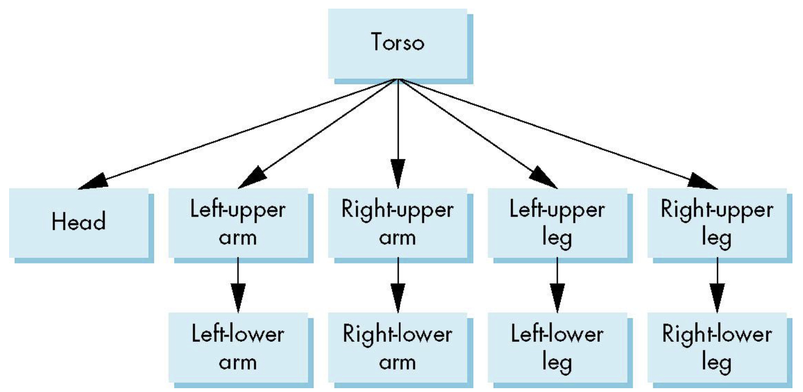
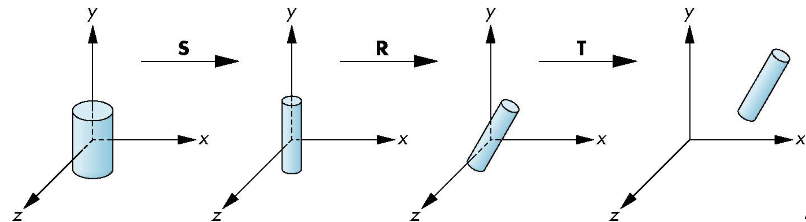
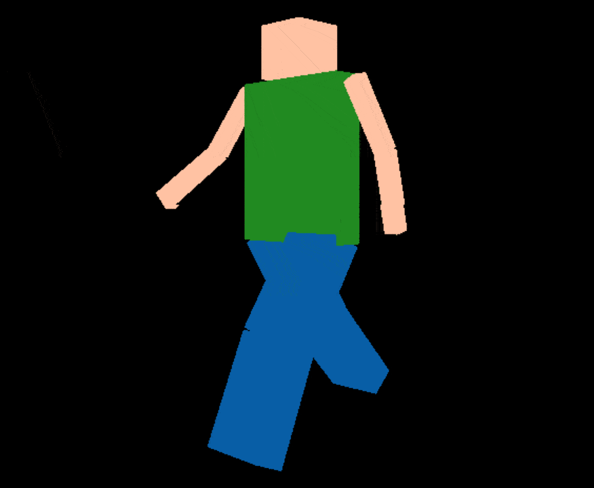

# HumanGL
This project is an introduction to **hierarchical modeling** and **matrix stack manipulation**.
We use matrices in order to link different parts of a model and make them move together in a logical way.

<br></br>

## Hierarchical modeling
When multiple parts are linked, we use the idea of **Hierarchical Modeling**. Taking a human as an example, the human body is composed of the following parts.

```
- Head
- Torso
- Two arms
    - Upper arm
    - Lower arm
- Two legs
    - Upper leg
    - Lower leg
```

When the torso moves, the head, arms and legs also move in tandem, creating a hierarchical structure starting from the torso.



[Reference page](https://teaching.csse.uwa.edu.au/units/CITS3003/lectures/020_Hierarchical_Modelling.pdf#page=22.00)

<br></br>

## Matrix stack manipulation
Once the hierarchical structure is created, scale, rotation, and translation are performed on the nodes at the top. So the set of transformation matrices looks like this. $S$ is scale, $R$ is rotation and $T$ is translation.

$$
M=TRS
$$



[Reference page](https://teaching.csse.uwa.edu.au/units/CITS3003/lectures/020_Hierarchical_Modelling.pdf#page=5.00)

This transformation matrix is propagated starting from the torso. Below is an example of how to create a model matrix for the lower leg during walking motion. In addition to the movement to the connection point with the upper leg, the rotation of the lower leg itself is added. In this example, the rotation of the lower leg is not taken into account.

```cpp
glm::mat4 LowerLeg::get_model_matrix(glm::vec3 upper_leg_pos) {
    float timeValue = glfwGetTime();
    float sign;
    if (position[0] < 0) {
        sign = -1.0;
    } else {
        sign = 1.0;
    }
    float rad = glm::radians(35.0 * sign * sin(3 * timeValue) + 10);
    glm::vec3 axis = glm::vec3(1.0f, 0.0f, 0.0f);
    glm::mat4 model = glm::mat4(1.0f);
    glm::mat4 rot_model = glm::rotate(model, rad, axis);
    glm::vec3 rotated_pos = rot_model * connect_pos;
    model = glm::translate(model, upper_leg_pos - rotated_pos);
    model = glm::rotate(model, rad, axis);

    return model;
}
```

<br></br>

## How to run
We can try a walking motion by running following command. We can see the body parts moving in unison.


```bash
export LD_LIBRARY_PATH=LD_LIBRARY_PATH:glfw/build/src
export LIBGL_ALWAYS_INDIRECT=0
cd srcs
make
./HumanGL
```



<br></br>

## References
- [Lecture 20: Hierarchical Modelling](https://teaching.csse.uwa.edu.au/units/CITS3003/lectures/020_Hierarchical_Modelling.pdf)
- [LearnOpenGL - Camera](https://learnopengl.com/Getting-started/Camera)
